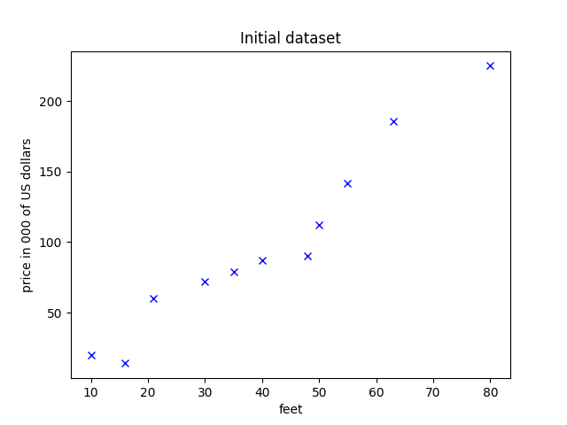
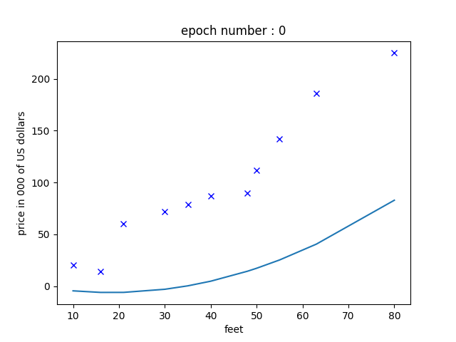
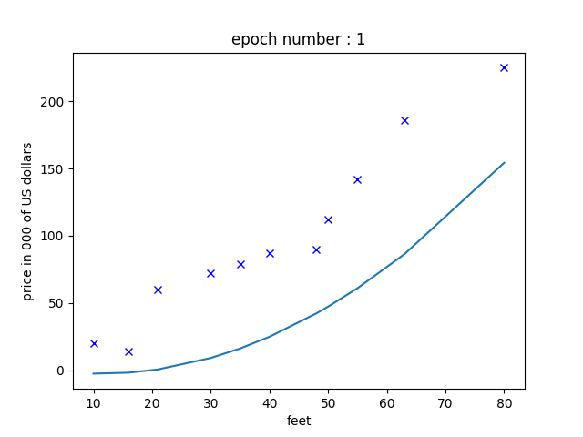
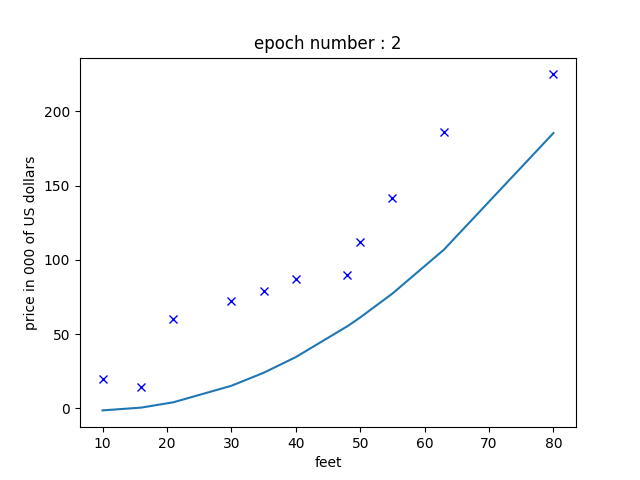
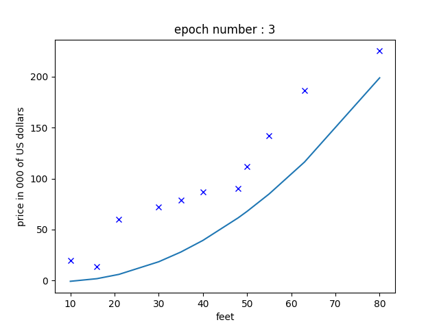
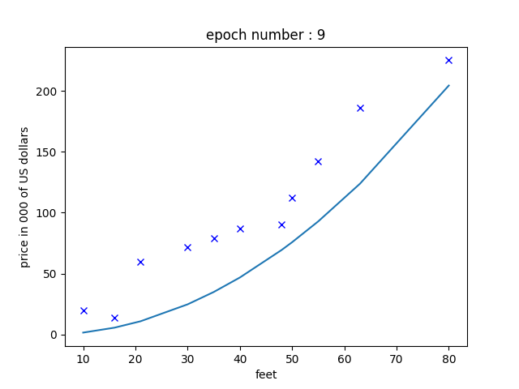
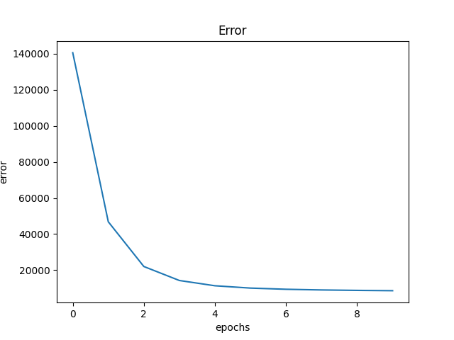

# Illustration of linear regression

Simple linear regression with 2D visualization.

## How to run

1) `$ pip install -r requirements.txt`

a) `$ python linear_regression_multiple_features.py`

b) `$ python linear_regression_one_feature.py`

## Sample output (with multiple features)

                                          ...

